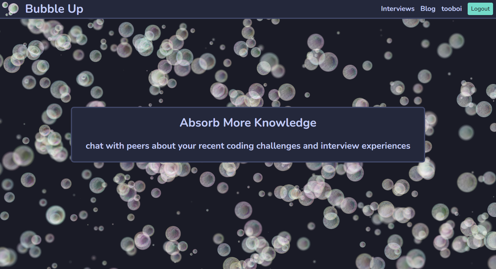

# Bubble Up

## Description

A place to record your interview experiences and talk about them with your peers

- Have a record of your interviews
- Chat with peers about their tech interview experience
- Have all of your job prep solutions in one place

## Table of Contents

- [Installation](#installation)
- [Usage](#usage)
- [Credits](#credits)
- [License](#license)

## Installation

- If you want to develop this app yourself you first need to have [Node.js](https://nodejs.org/en/) installed and a [mongoDB](https://www.mongodb.com/) account set up

- After you clone this repo, `npm i` in the root of the folder to install all the node packages (this will take a minute)

- Then create a `.env` file in the root of the folder and add: `AUTH_SECRET='<your secret key>'`

- Then run `npm run seed` to add template data to the app

- Finally you can run `npm run develop` to open the app in development mode and play around

## Usage

No installation necessary, please visit the following link to view the deployed site [Bubble Up]()

- To use this site, you must first make an account and sign in

- You can then view interview prompts, interviews, prompt solutions, and your own stats

- You also have the ability to log your interview experiences

- You will be met with the following page with your username as the profile name

## Credits

- ChatGPT

- Leif Hetland

- [Boring Avatars](https://github.com/boringdesigners/boring-avatars-service)

- [The Web School.](https://www.youtube.com/watch?v=WkREeDy2WQ4&ab_channel=TheWebSchool.)

## License

This app is licensed under the [MIT License](./LICENSE)

## How to Contribute

If you would like to contribute, reach out on GitHub
